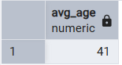
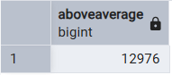
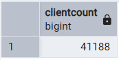
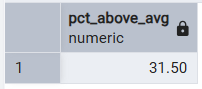
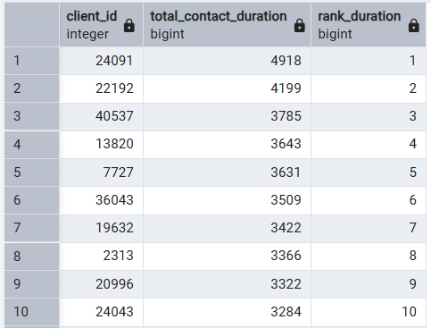
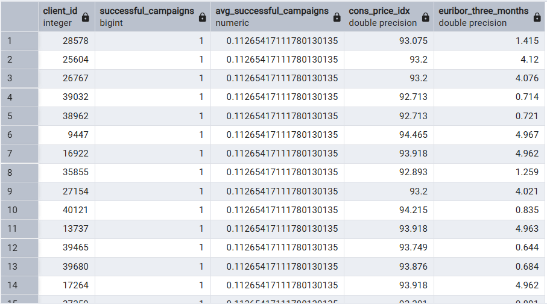

# Bank Marketing Data Engineering Project

## Overview
This project simulates the work of a Data Engineer tasked with preparing marketing campaign data for a bank. The dataset was cleaned and structured to be stored in PostgreSQL, enabling future campaigns to be easily imported and analyzed.

---

## Dataset Contents
The original dataset contained information about:
- **Clients**: demographics, job, marital status, education, credit default, mortgage.  
- **Campaigns**: number of contacts, duration, outcomes of current and previous campaigns, last contact date.  
- **Economics**: consumer price index and euribor three-month rate.  

---

## Data Cleaning Requirements (pandas)
- **String replacements**: replaced `"."` with `"_"` in categorical columns; `"unknown"` → NaN in `education`.  
- **Data type conversions**: mapped categorical text values into booleans (`yes/no`, `success/failure`).  
- **Boolean logic**: implemented conditional mapping for campaign outcomes and credit/mortgage flags.  
- **Column creation**: built `last_contact_date` from day, month, and fixed year=2022.  
- **DataFrame splitting**: separated the dataset into three logical tables (`client`, `campaign`, `economics`).  

---

## Data Engineering Steps
1. **Schema design**: normalized into three tables (`client`, `campaign`, `economics`) with clear relationships.  
2. **Cleaning & transformation**: applied replacements, type conversions, boolean logic, and column creation using pandas.  
3. **Load**: the cleaned DataFrames were loaded into PostgreSQL tables using SQLAlchemy.  
4. **SQL analysis**: queries were executed to answer business questions.  

---

## Business Questions & SQL Analysis

### 🔹 Question 1 — JOIN
**What is the average age of clients who responded positively to campaigns (`campaign_outcome = TRUE`)?**  
 Result: **~41 years**

### 🔹 Question 2 — Subquery
**What percentage of clients had more contacts than the global average?**  
 Result: **12,976 clients above average out of 41,188 (~31.5%)**

### 🔹 Question 3 — Window Function
**How are clients ranked by the total duration of their contacts?**  
 Result: Ranking of clients by intensity of contact.

### 🔹 Question 4 — JOIN + Window Function + Economics
**How many successful campaigns did each client have, and how does this compare to the global average? What economic indicators were associated?**  
 Result: Clients with their number of successful campaigns vs. global average, plus `cons_price_idx` and `euribor_three_months`.

## Conclusion
This project demonstrates core **Data Engineering skills**:
- Data cleaning and transformation with pandas.  
- Relational schema design for PostgreSQL.  
- Loading structured data into SQL tables.  
- Advanced SQL queries (JOINs, subqueries, window functions).  
- Business insights derived from marketing campaign data.  

It provides a reusable pipeline for future bank marketing campaigns and showcases practical SQL analysis for real-world scenarios.

